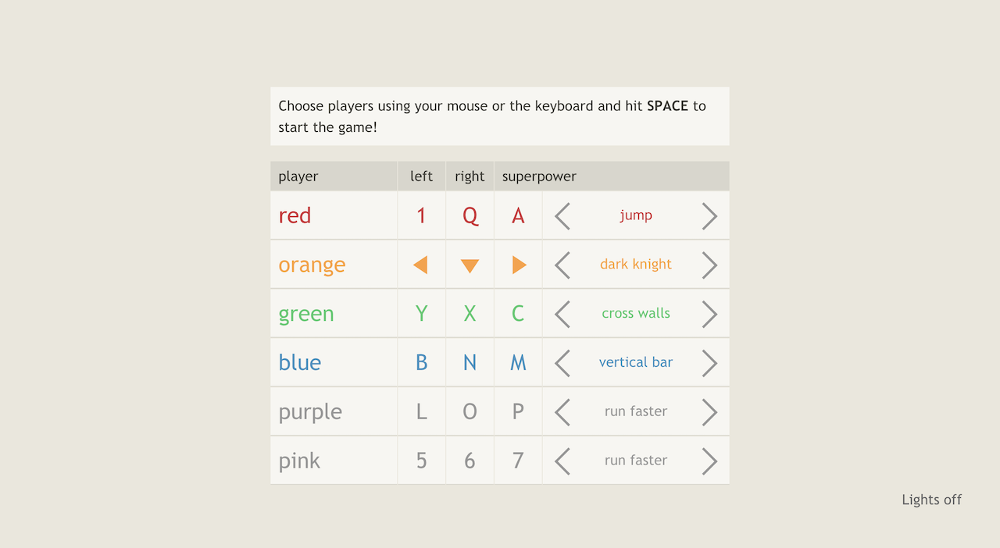
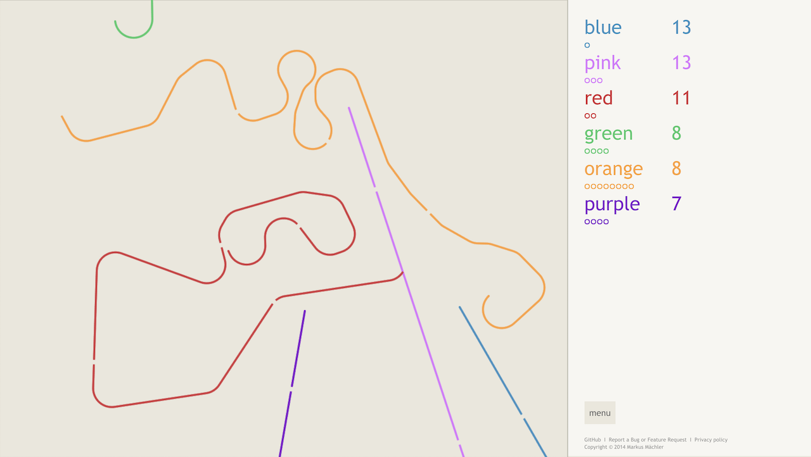
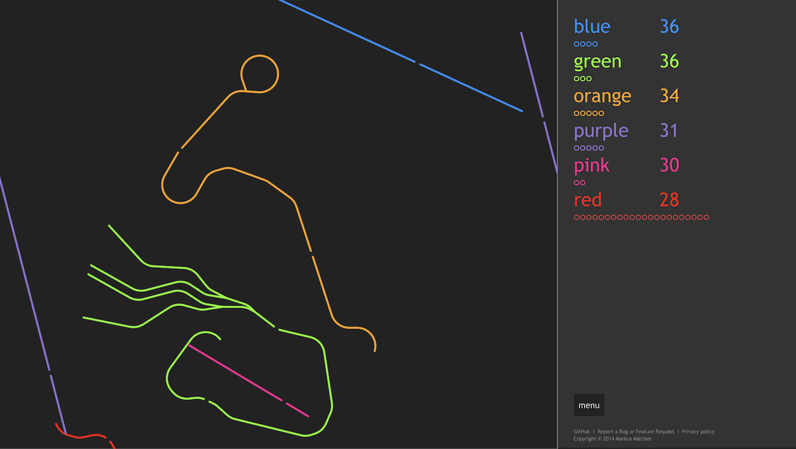

# Achtung, die Kurve!
This is an open source HTML5 implementation of the famous game also known as Curve Fever, Zatacka or simply Kurve.

## Want to download Achtung, die Kurve and play offline?
No problem! Just download the [sources](https://achtungkurve.com/download/kurve-1.5.0.zip) and double click the file index.html to open it in your favourite browser.

## Screenshots

  

## Development

### Requirements for development
- node.js
- npm
 
### Installing dependencies
```sh
npm install
```

### Building sources during development
```sh
gulp watch
```

### Building sources for production
```sh
gulp build
```
